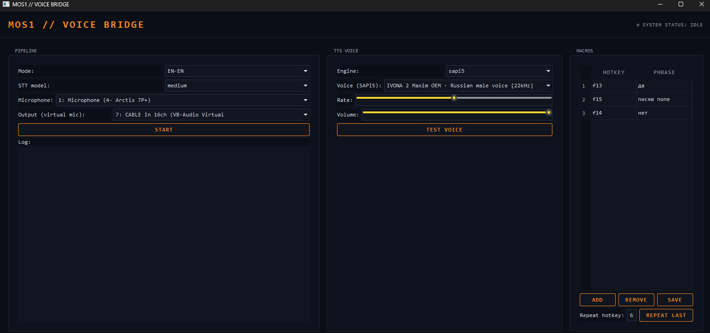

# MOS1 // VOICE BRIDGE

Step 1. Check your Python version
Enter the following command:

Bash
python --version
You need version 3.10 or 3.11. If you have 3.12 or newer, faster-whisper and PySide6 might run into installation issues. If that happens, just let me know and we'll sort it out separately.

Step 2. Install dependencies
Run:

Bash
pip install -r requirements.txt
This will take some time, as faster-whisper and PySide6 are fairly large packages. If you get a red error message anywhere, don't panic—just copy and paste the entire thing to me.

Step 3. Install a virtual microphone
Download VB-Cable (search for "VB-CABLE Virtual Audio Device" on the vb-audio.com website). Install it like a regular program, and then restart your computer. After rebooting, two new audio devices will appear in your system: CABLE Input and CABLE Output.

Step 4. Install language packs for translation
If you need RU-EN or EN-RU modes, enter this command in the same command prompt:

Bash
python -c "import argostranslate.package as pkg; pkg.update_package_index(); [pkg.install_from_path(p.download()) for p in pkg.get_available_packages() if (p.from_code, p.to_code) in [('ru','en'), ('en','ru')]]"
If you only need RU-RU or EN-EN for now, you can skip this step and come back to it later.

Step 5. Run the program
Execute the following command:

Bash
python main.py
A dark-themed window should open displaying three cards: PIPELINE, TTS VOICE, and MACROS.

Step 6. Configure the window
In PIPELINE: Select a mode (e.g., RU-RU for a start, as it's the simplest setup). Choose your physical microphone in the "Microphone" field, and set the "Output" field to "CABLE Input".

In TTS VOICE: The "Voice (SAPI5)" field should display a list of voices installed in Windows. If Ivona Maxim isn't there, it means it isn't installed as a system voice. Pick any other voice from the list just to verify that everything works—we can hook up Kava's voice in a separate step later.

Click TEST VOICE, and a test phrase should play. If you have the Windows "Sound" → "Recording" settings open, you should be able to see that "CABLE Output" is receiving an audio signal.

Step 7. Test the pipeline
Click START and say something into the microphone. After a second or two, the recognized text should appear in the "History" field, and you should hear the voiceover play on CABLE Input.